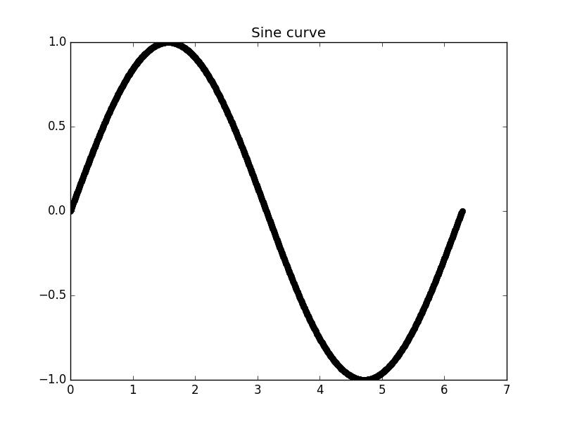

# Exercise 9: Comparing data to predictions
In this week's exercise we will work on comparing observations (data) to predictions.
In particular, we will explore two different ways in which we can compare data to a prediction:

- Comparing individual measured values to their equivalent predicted values using a *goodness-of-fit* equation
- Fitting a line to *xy* data using the *least squares regression*

Both of these cases are frequently used, and can even be conducted in commonly used software such as **Microsoft Excel**, but our goal is to understand what the numbers from these "fits" mean, and how they are calculated.

This exercise is due by the start of class on **14.11.2016**.
Late submissions will lose 25% of the total points per day late unless discussed with Dave or Jorina in advance of the due date.

## Problem 1: Calculating a goodness-of-fit
For this problem, you are given a [broken Python script](read-and-plot-data.py) for reading and plotting [thermochronometer age data](Coutand2014-AFT-ages.txt).
Your job is to fix the **6 issues** with the script so that it does what says it should in the comments.
The issues are in comments that start with the text `# FIX`.
Data for this exercise comes from a [recent paper published on the exhumation of the Himalaya in Bhutan](http://dx.doi.org/10.1002/2013JB010891), in case you're curious.
Your modified script should

1. Read the data file [`Coutand2014-AFT-ages.txt`](Coutand2014-AFT-ages.txt) and split the data into separate arrays for each variable.
2. Calculate the goodness of fit between the measured and predicted ages in the data file.
The goodness of fit equation you should use is

     
where *N* is the number of ages, *Oi* is the *i*th measured age, *Ei* is the *i*th predicted age, and *σi* is the *i*th standard deviation.
3. Produce a plot of the measured ages with their error bars and the predicted ages, both as a function of latitude.
Be sure to display the calculated goodness-of-fit value from point 2 as text on the plot, and include axis labels and a title.

**For this problem, save a modified copy of the code in your GitHub repository, and edit the `README.md` document to display a copy of your plot and answers to the questions below.**

### Questions for Problem 1
1. Looking at your plot and without looking at the goodness of fit value, how well would you say the predicted ages fit the measured ages in this example?
Is this difficult to do?
Why or why not?
2. How well would you say the predicted ages fit the measurements using the calculated goodness of fit?
Is your calculated goodness of fit intuitive to use?
Why or why not?

## Problem 2: Linear data regression

### Tasks/Questions for Problem 2

## Hints
If you get stuck, have a look at the [hints for this week's exercise](https://github.com/Intro-Quantitative-Geology/Lesson-8-Basic-geostatistics/blob/master/Lesson/hints.md).

### Footnote(s)
[1]: [Coutand, I., Whipp, D.M., Grujic, D., Bernet, M., Fellin, M.G., Bookhagen, B., Landry, K.R., Ghalley, S.K. and Duncan, C., 2014. Geometry and kinematics of the Main Himalayan Thrust and Neogene crustal exhumation in the Bhutanese Himalaya derived from inversion of multithermochronologic data. *Journal of Geophysical Research: Solid Earth*, *119*(2), pp.1446-1481](https://dx.doi.org/10.1002/2013JB010891)

# Answers
This is some text.
You can make it **bold** or use *italics*.
You can also display images, as shown below.

 
*Figure 1. A sine curve*.
